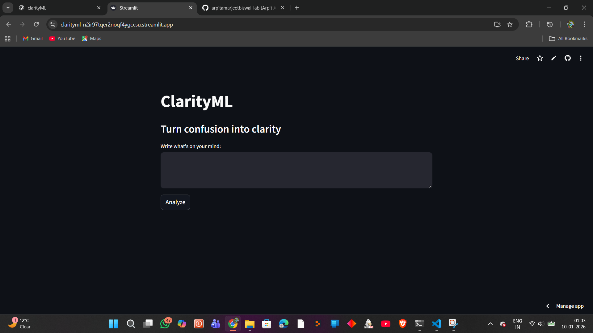
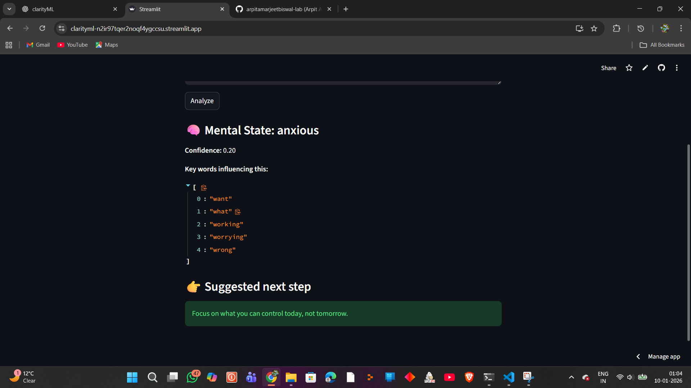

# 🧠 ClarityML  
**Turn confusion into clarity using explainable machine learning**

🔗 **Live App:**  
👉 https://clarityml-n2i97tqer2noq4ygccsu.streamlit.app

---

## 📌 Overview

**ClarityML** is a human-centered machine learning application that analyzes free-text thoughts to identify a user’s mental state and suggest actionable next steps.

Unlike generic AI chatbots, ClarityML focuses on:
- **Decision clarity**
- **Explainable predictions**
- **Action-oriented guidance**

---

## 🧠 What It Does

Given a short text input, ClarityML:
- Detects the mental state  
  *(confused, anxious, avoidant, clear, motivated)*
- Shows prediction confidence
- Explains *why* the prediction was made (key influencing words)
- Suggests a simple, practical next step

---

## 🖼️ Screenshots

### 🔹 Home Interface

### 🔹 Prediction Output

---

## 🔍 How It Works

1. User inputs free-form text
2. Text is vectorized using **TF-IDF**
3. A **Logistic Regression** classifier predicts the mental state
4. Feature weights are used for **explainability**
5. A tailored next step is generated
6. Results are displayed via **Streamlit UI**

---

## 🛠️ Tech Stack

- **Python**
- **Scikit-learn**
- **Pandas & NumPy**
- **Streamlit**
- **Jupyter Notebook**
- **Git & GitHub**

---

## 🚀 Deployment

- Deployed on **Streamlit Community Cloud**
- Portable file handling using dynamic paths
- Publicly accessible web application

🔗 Live URL:  
https://clarityml-n2i97tqer2noq4ygccsu.streamlit.app

---

## 🎯 Use Cases

- Overthinking & decision paralysis
- Early-stage self-reflection
- Productivity & focus assessment
- Demonstration of explainable NLP models

---

## 📂 Project Structure

ClarityML/
├── app.py
├── notebooks/
│ ├── model.pkl
│ ├── vectorizer.pkl
│ └── mental_states.csv
├── requirements.txt
├── README.md

yaml
Copy code

---

## 👤 Author

**Arpit Amarjeet Biswal**  
6th-semester undergraduate, Government College of Engineering, Keonjhar  
CGPA: 8.52  
IBM & Microsoft certified in AI/ML and Big Data  

---

## ⭐ Acknowledgements

Built as an end-to-end machine learning project focusing on:
- explainability
- real-world deployment
- human-centered AI design

---

⭐ If you find this project useful, consider starring the repository.
